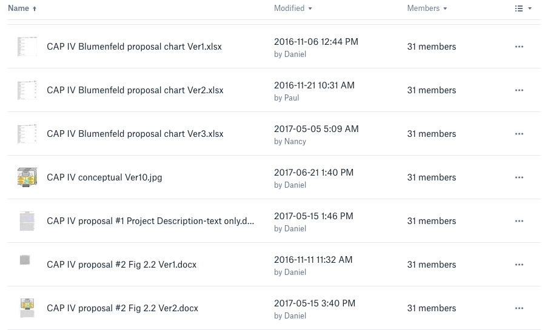
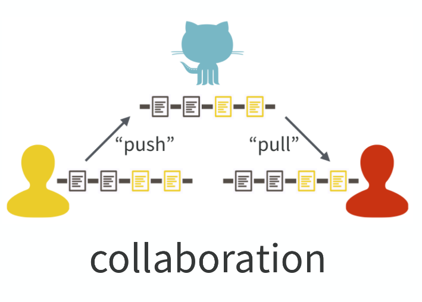
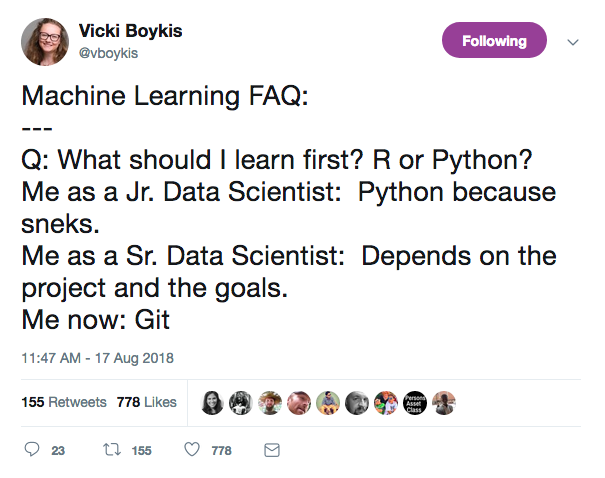

```{r setup, include=FALSE}
options(htmltools.dir.version = FALSE)
```


class: inverse

#### file chaos

.center[
  
]


---

#### what does it do?

* git watches repositories (like a directory) for changes

* git asks that you describe changes when they are made

* git remembers old versions if you need them

* git also keeps an eye out for conflicts, and forces you to resolve them

.footnote[Jeff Goldsmith ["Git"](https://speakerdeck.com/jeffgoldsmith/dsi-git-and-github)]


---

#### git + GitHub 

when combined with a service such as GitHub

* ...allows multiple people to contribute to the same repository, and does all of the aforementioned for everyone at once

.center[
  
]

.footnote[Jeff Goldsmith ["Git"](https://speakerdeck.com/jeffgoldsmith/dsi-git-and-github)]


---

#### version control: git

.light-blue[tame the chaos] 👏

.center[
  
]


---
class: inverse

#### version control: git

.center[
  
]